# SenseCAP K1100

[SenseCAP K1100 - The Sensor Prototype Kit](https://www.seeedstudio.com/Seeed-Studio-LoRaWAN-Dev-Kit-p-5370.html) represents Seeed Studio concentrating the essence of LoRa® communication on technology and edge intelligence products, for the easiest deploying and mastering of LoRa® and IoT applications.

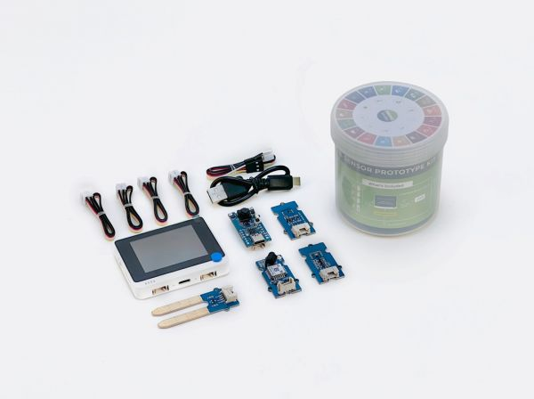

## Setup

SenseCraft is an open source software platform to build smart sensors with no-code. It is a program built into the Wio Terminal in SenseCAP K1100.

Before you begin, we recommend that you upgrade to the latest version of SenseCraft to ensure the most stable experience.

### Task - setup

Install the required SenseCraft and update the firmware.

1. You can download and update the latest version in our **SenseCraft distribution** by clicking on the URL below.

    >🔗: https://github.com/Seeed-Studio/SenseCraft/releases

    After downloading SenseCraft to your local disk, please follow the instructions below to flash it into Wio Terminal.

2. Connect the Wio Terminal to PC and turn in ON, Enter **Bootloader Mode** by sliding down the power switch further away from "ON" position, release, slide again and release.

    > 💁 Once Wio Terminal is in the Bootloader mode, the blue LED will start to breathe in a way that is different from blinking.

    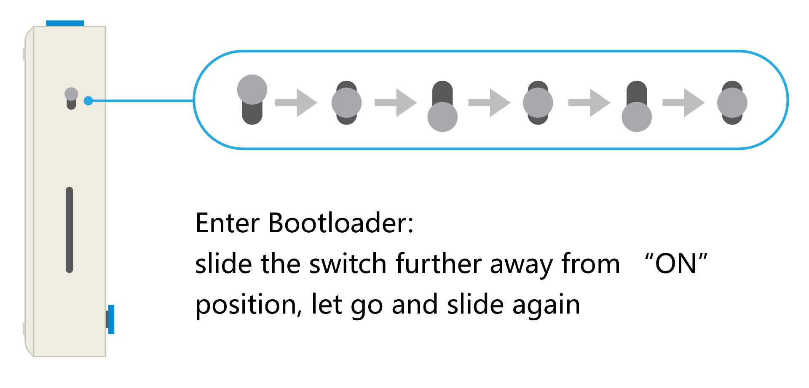

3. Open File Explorer on your PC and you will see a new external drive, named **Arduino**, drag the previously downloaded **.uf2** file into this **Arduino** drive.

4. Once the SenseCraft flash is complete, the external memory named Arduino will automatically pop up and the SenseCraft program will start working.

    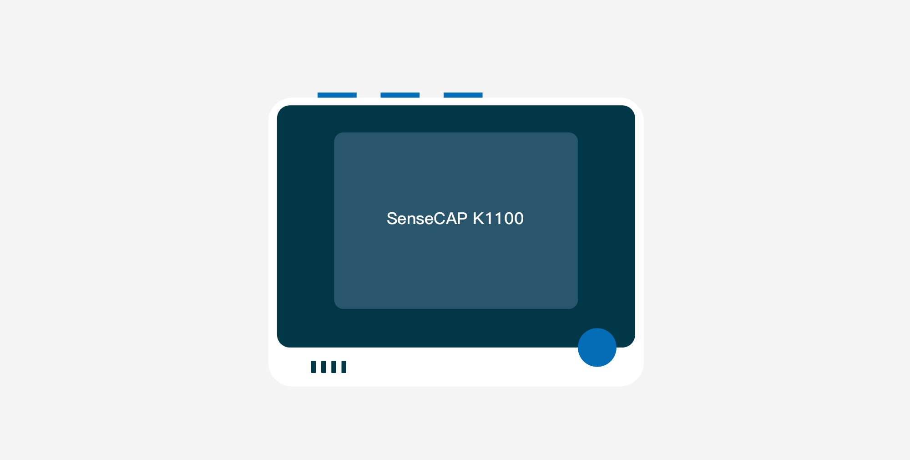

## Navigate the UI using buttons

Before you get into learning the operating interface, you need to get used to the Button logic we have designed for Wio Terminal. In this way, you will be able to select and operate pages very smoothly according to the fixed Button logic.

### Task - master SenseCraft button logic

1. First are the three buttons located above the Wio Terminal. They correspond to the display screens of the three main functions. They are **Sense**, **Process** and **Uplink** respectively.

    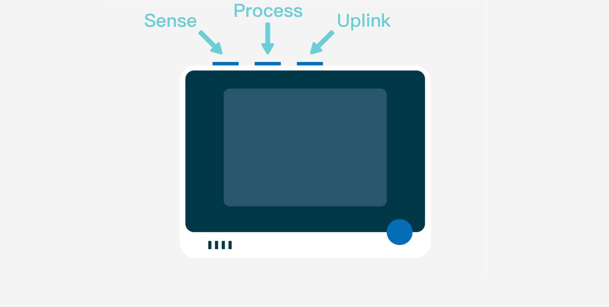

    No matter where you are, when you press the three buttons at the top, you will be able to go back to these three screens.

1. Then there is the five-way directional button located at the bottom right of Wio Terminal, which allows you to perform the following operations:

    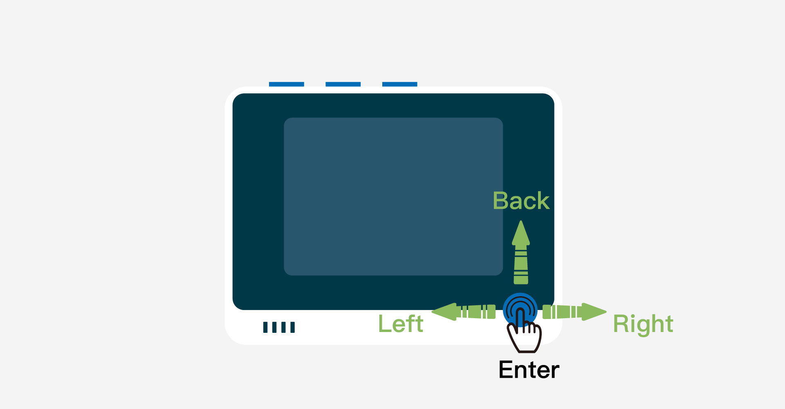

    - **Left/ Right:** Scroll through pages/ menus left and right
    - **Middle:** Make a selection
    - **Up:** Go back to the previous page

3. When a green box appears on the page, it indicates that the content is in the selected state.

    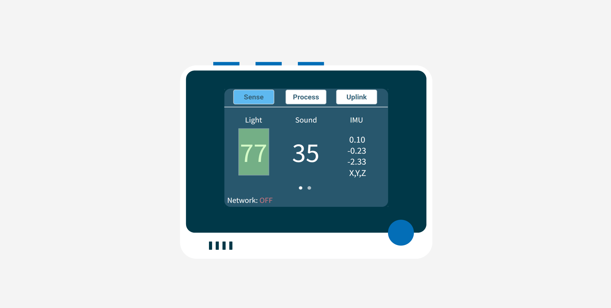

## Page Logic

As mentioned above, we have prepared three pages for SenseCraft, representing the three main functional modules of SenseCraft, namely **Sense**, **Process** and **Uplink**.

### Task - learn the functions of Sense page

1. The main function of the Sense page is the sensor data display. Of course, if you try to connect the Grove sensors in the kit to the Grove connector on the **right** side of the Wio Terminal, you will find that the Wio Terminal will automatically detect the type of sensors and read their values.

2. Wio Terminal has three built-in sensors: a light sensor, a sound loudness sensor, and a three-axis sensor. After you power Wio Terminal up, wait a few seconds and you will be able to see the values of the built-in sensors directly on the Sense page.

    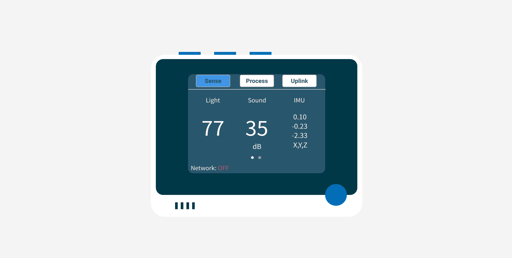

3. In the current version of SenseCraft we only support the simultaneous connection of one sensor for use. (except for the Grove Wio E5) When connecting, you can use the Grove cable provided in the kit to connect one of the sensors you want to use to the Grove connector on the bottom right of the Wio Terminal.

    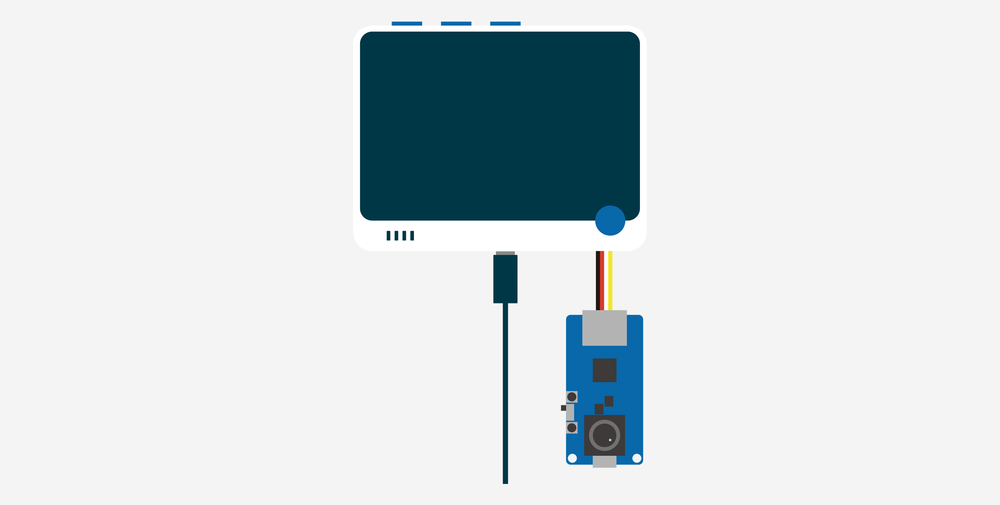

    The diagram above shows the Grove Vision AI as an example, indicating how the sensors in the kit are connected. Of course, the same applies to other sensors. (except for the Grove Wio E5)

    > 💁 Do not connect the Grove sensor in the kit to the Grove connector on the left side of the Wio Terminal. The Grove connector on the left is currently designed for the connection of the Grove Wio E5.

4. Once you have connected the Grove sensor you will be able to view the Grove sensor values in the Sense page. You just need to press the **right** arrow button under the Sense page until the value of the external sensor appears. Usually, the value of the external sensor will be after the IMU sensor.

    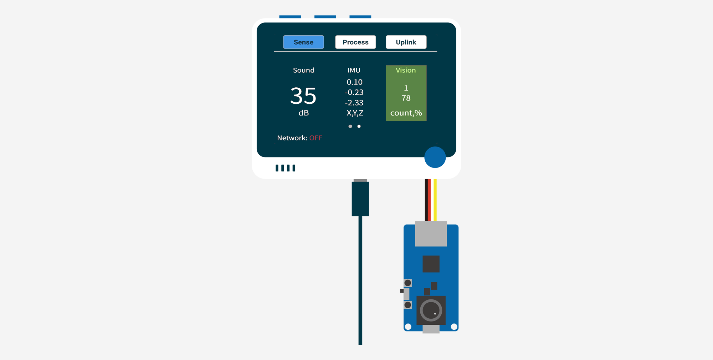

5. Considering that users may have the need to save offline to an TF card and only require subsequent data filtering or analysis, we have also designed the Wio Terminal with the ability to save data to a TF card. When in graph visualization mode as described before, **middle press** again to view this page.

    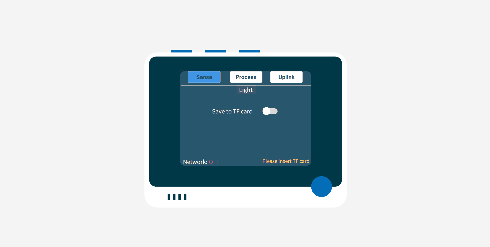

    This is where the data from the sensor can be saved to an TF card. First insert an TF card to the Wio Terminal. After that, press the **middle button** to select **Save to TF card** and it will show the message **Saving has been started**. Once this message dissappears, the saving is finished and it will save the data as a **.csv file**.

### Task - learn the functions of Process page

1. The main function of the **Process** page is to show the process of data processing. We have currently developed log output for this page for the recognition and model processing of the Grove Vision AI module.

    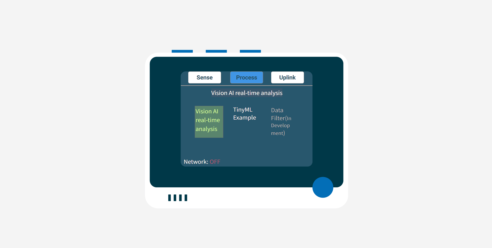

2. Please connect your Grove Vision AI to the Grove connector on the right side of the Wio Terminal. Please click on the second button above the Wio Terminal to access the Process screen. The default selection under the Process screen is "Vision AI real-time analysis", at which point we simply middle press on the 5-way button to enter. 

    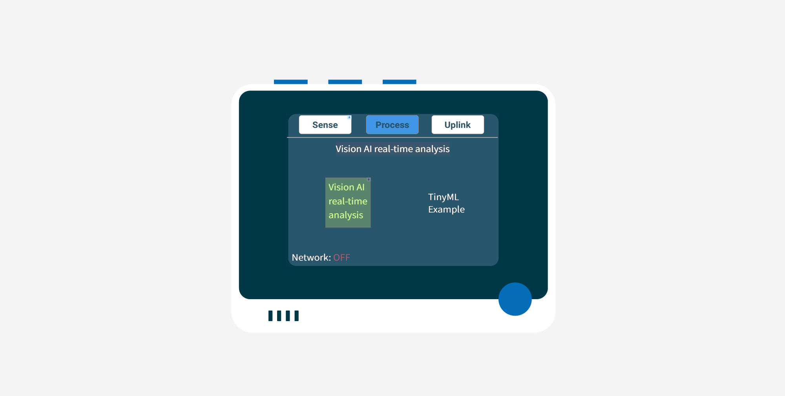

    Then you will be able to see Vision AI log on this page.

    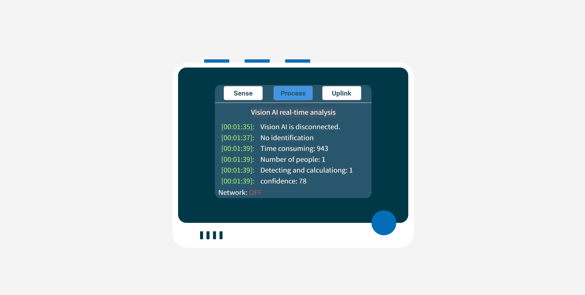

3. Access the **Process** screen, press the right arrow of the five-way button to select TinyML Example. Simply **middle press** on the 5-way button to enter. Under this page, users can scan into the TinyML series of courses we have prepared to experience the powerful machine learning capabilities of Wio Terminal & Vision AI.

    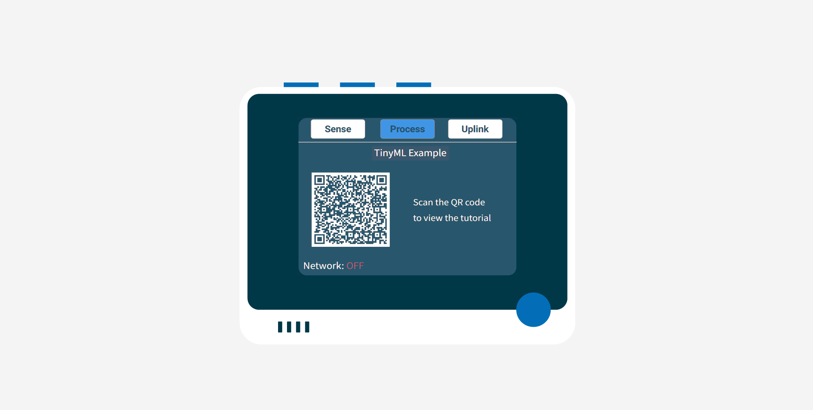

### Task - learn the functions of Uplink page

1. The main function of the **Uplink** page is to upload data to the cloud. Users can configure which IoT method you want to use, LoRa® or WiFi, on this page.

    Here, you can freely configure your exclusive IoT features, freely switch between different networks and platforms, and create its value for this set of devices.

    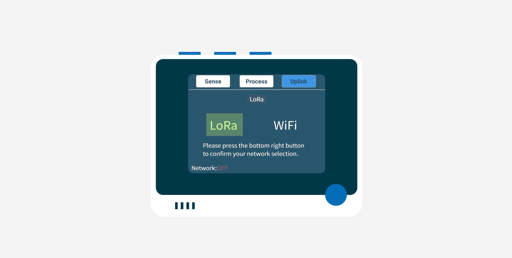

    We will cover the process of how to achieve a codeless IoT in a later course, so stay tuned.

## Resources

If you are interested in learning more about SenseCraft, you can visit the SenseCraft website to learn more.

- [GitHub][Seeed_Arduino_K1100 Source Code](https://github.com/Seeed-Studio/Seeed_Arduino_K1100)
