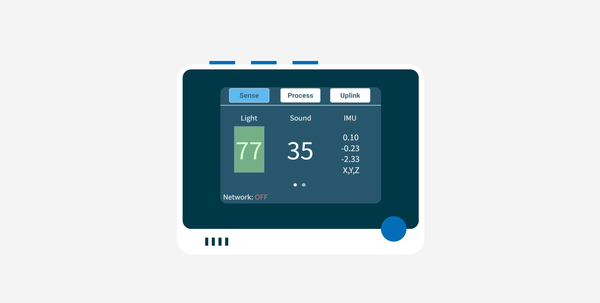

# Add a sensor - SenseCAP K1100

In this part of the lesson, you will use the light sensor on your SenseCAP K1100.

## Hardware

The sensor for this lesson is a **light sensor** that uses a [photodiode](https://wikipedia.org/wiki/Photodiode) to convert light to an electrical signal. This is an analog sensor that sends an integer value from 0 to 1,023 indicating a relative amount of light that doesn't map to any standard unit of measurement such as [lux](https://wikipedia.org/wiki/Lux).

The light sensor is built into the Wio Terminal and is visible through the clear plastic window on the back.

## Observe the light sensor

The SenseCAP K1100, based on SenseCraft, enables real-time output of light sensor values without the need for programming.

### Task

Observe the light sensor.

1. Please complete the SenseCraft update and power up the Wio Terminal as per the previous lessons.

1. With the Wio Terminal facing you, press the leftmost blue button on the top of the Wio Terminal, which is closest to the power button. Make sure you are currently in the Sense screen.

1. As you can see, the first sensor value in the Sense page is the light value. This light value is refreshed once per second. You can observe how the light value changes under different lighting conditions.

😀 Adding a sensor to your nightlight program was a success!
