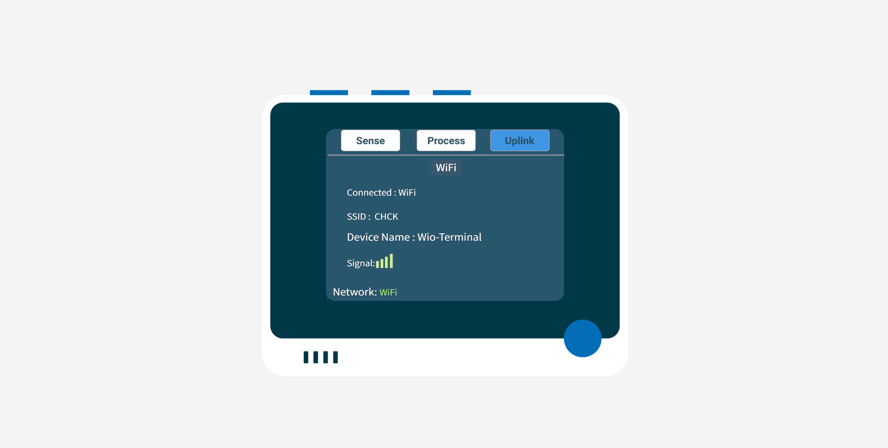

# Configure access to the network - SenseCAP K1100

In this part of the lesson, you will learn how to configure SenseCraft to enable the Wio Terminal to connect to a wireless LAN.

## Configure the config.txt file

SenseCraft connects to a wireless LAN by recognising the WiFi name and password in the "config.txt" file that is automatically generated in Wio Terminal.

1. Please complete the SenseCraft update and power up the Wio Terminal as per the previous lessons.

2. Please use the original USB-C cable to connect the Wio Terminal to your computer.

3. A USB stick appears as soon as the Wio Terminal is connected to the computer. At this point, there will be a "config.txt" file inside the USB stick. Please open it with a suitable txt editor and add the required configuration to it.

    ```
    SSID=WiFi_Name
    PASSWORD=WiFi_Password
    DEVICE_LABEL=Device_Name
    ```

    Please replace the "WiFi_Name", "WiFi_Password" after the equal sign with the name of the WiFi you want the Wio Terminal to connect to and the corresponding password respectively. Replace "Device_Name" with the name you want to give Wio Terminal.

4. Save the modified file using the shortcut "Ctrl + S" or by using the save button of your text file editing software.

5. Toggle the side button down once and release, the Wio Terminal will reboot, after which it will automatically load your modified config.txt file.

6. When you are facing the front screen of the Wio Terminal, press the blue button on the far right at the top (which is the one furthest from the power button) to go to the Uplink page.

7. With the directional rocker, control the green checkbox to select WiFi, after which press the middle button to confirm the connection via WiFi. Afterwards, Wio Terminal will automatically connect to WiFi based on the WiFi information you have entered.

    

    > 💁 Please note that if the page above appears it does not necessarily mean that the connection was successful, you need to look again at the number of signal cells in the page. If the signal count is 0, you may have failed to connect to the network and you will need to change networks or check your input.

😀 You have successfully got your device to connect to your wireless LAN.