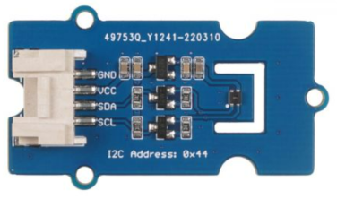
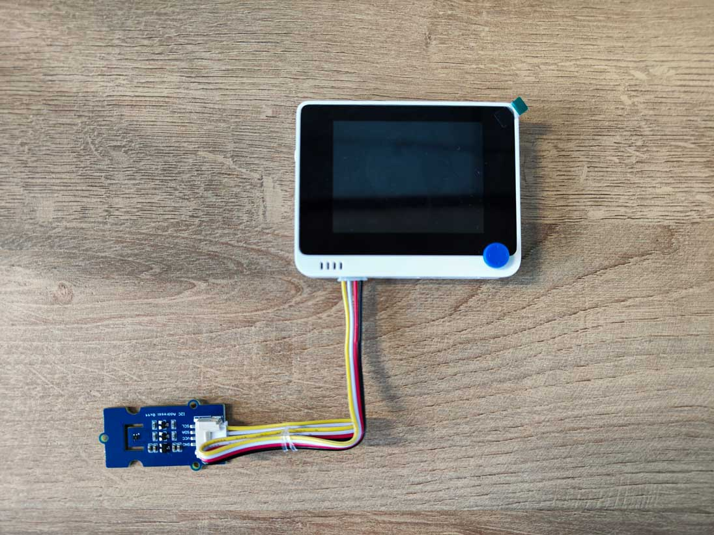

# Measure temperature - SenseCAP K1100

In this part of the lesson, you will add a temperature sensor to your SenseCAP K1100, and read temperature values from it.

## Hardware

The Wio Terminal needs a temperature sensor. The sensor is included in the SenseCAP K1100 kit.

The sensor you'll use is a [SHT40 humidity and temperature sensor](https://www.seeedstudio.com/Grove-Temp-Humi-Sensor-SHT40-p-5384.html), combining 2 sensors in one package. This is fairly popular, with a number of commercially available sensors combining temperature, humidity and sometimes atmospheric pressure. The SHT40 sensor uses the thermocouple method to measure temperature. The thermocouple consists of two metal wires of different materials. One end of the two wires is soldered together to form the working end, which is in contact with the environment where the temperature is to be measured. The other end is called the free end and is connected to the main controller to form a closed loop. When the temperature at the working end and the free end differs, a thermoelectric potential appears in the loop and this change in voltage is transmitted to the microcontroller via circuit conversion and converted into a digital signal that the machine can recognise.

The SHT40 temperature and humidity sensor uses the I²C communication protocol, so it is necessary to use the on-board I²C , which receives the data information containing the temperature and humidity.

### Connect the temperature sensor

The Grove temperature sensor can be connected to the Wio Terminals I²C port.

#### Task - connect the temperature sensor

Connect the temperature sensor.

1. Insert one end of a Grove cable into the socket on the humidity and temperature sensor. It will only go in one way round.

1. With the Wio Terminal disconnected from your computer or other power supply, connect the other end of the Grove cable to the left-hand side Grove socket on the Wio Terminal as you look at the screen. This is the socket closest away from the power button.

## Use the temperature sensor

The SenseCAP K1100 can now observe the temperature and humidity sensor values via the SenseCraft program.

### Task Observe the temperature sensor data

1. Please complete the SenseCraft update and power up the Wio Terminal as per the previous lessons.

2. Please use the original USB-C cable to connect the Wio Terminal to your computer.

3. When you are facing the front screen of the Wio Terminal, press the blue button on the far left at the top (which is the one closest from the power button) to go to the Sense page.

4. You need to press the right arrow button under the Sense page until the value of the SHT40 data appears. Usually, the value of the external sensor will be after the IMU sensor.

😀 Your temperature sensor program was a success!
