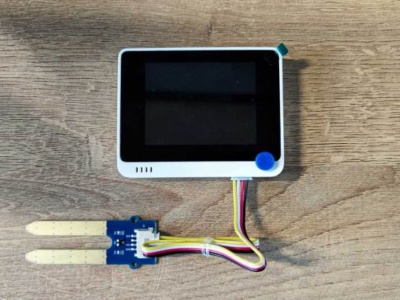
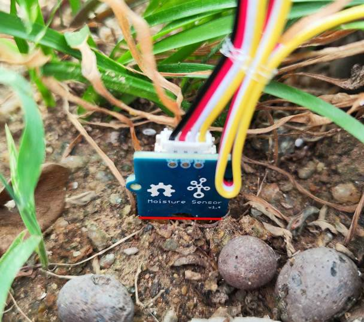

# Measure soil moisture - SenseCAP K1100

In this part of the lesson, you will add a resistive soil moisture sensor to your SenseCAP K1100, and read values from it.

## Hardware

The Wio Terminal needs a resistive soil moisture sensor. The sensor is included in the SenseCAP K1100 kit.

The sensor you'll use is a [resistive Soil Moisture Sensor](https://www.seeedstudio.com/Grove-Moisture-Sensor.html), that measures soil moisture by detecting the Resistance of the soil, a property than changes as the soil moisture changes. As the soil moisture increases, the lower the resistance value, the higher the voltage rises.

This is an analog sensor, so connects to analog pins on the Wio Terminal, using an onboard ADC to create a value from 0-1,023.

### Connect the soil moisture sensor

The Grove soil moisture sensor can be connected to the Wio Terminals configurable analog/digital port.

#### Task - connect the soil moisture sensor

Connect the soil moisture sensor.

1. Insert one end of a Grove cable into the socket on the soil moisture sensor. It will only go in one way round.

2. With the Wio Terminal disconnected from your computer or other power supply, connect the other end of the Grove cable to the right-hand side Grove socket on the Wio Terminal as you look at the screen. This is the socket farthest away from the power button.

3. Insert the soil moisture sensor into soil. It has a 'highest position line' - a grey dotted line dividing the yellow area from the blue area. Insert the sensor up to but not past this line.

## Use the soil moisture sensor

The SenseCAP K1100 can now observe the soil moisture sensor values via the SenseCraft program.

### Task - Observe the soil moisture sensor data

1. Please complete the SenseCraft update and power up the Wio Terminal as per the previous lessons.

2. Please use the original USB-C cable to connect the Wio Terminal to your computer.

3. When you are facing the front screen of the Wio Terminal, press the blue button on the far left at the top (which is the one closest from the power button) to go to the Sense page.

4. You need to press the right arrow button under the Sense page until the value of the soil moisture sensor data appears. Usually, the value of the external sensor will be after the IMU sensor.

😀 Your soil moisture sensor program was a success!
