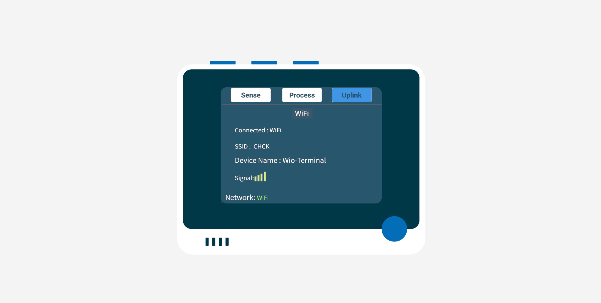

# Connect your IoT device to the cloud - SenseCAP K1100

In this part of the lesson, you will connect your SenseCAP K1100 to your IoT Central, to send Wio Terminal built-in sensor and soil moisture sensor data.

## Microsoft Azure IoT Central Set Up

If you want to connect the SenseCAP K1100 to IoT Central, then you first need to obtain the API information for IoT Central.

### Task - Get the API for IoT Central connected devices

1. Enter the following link in your browser to go to the IoT Central website. Click **Build** from the navigation menu on the left, and click **Custom apps**.

    > 🔗: https://apps.azureiotcentral.com/home

    If you are not already logged into Azure IoT Central, you will be asked to complete a registration/login at this point.

    <div align=center></div>


2. Fill in **Application name** and choose **Standard 0** under the **Pricing plan**. Application URL will be created automatically when you fill in application name. In this example, we will accomplish this task at minimal cost.

    <div align=center></div>


    > 💁 If you are a new user of Azure IoT Central, we recommend that you select **Free** as this will not consume your fees.
        <div align=center></div>

3. Please create a new device template by clicking on **Device templates** in the left-hand menu bar.

    <div align=center></div>

    Please select **Wio Terminal** as our template.

    <div align=center></div>

    Then just click on **Create**.

    <div align=center></div>

    Then, a ready-made template is created.

    <div align=center></div>

4. Click on **Devices -> Seeed Wio Terminal** under the left menu bar.

    <div align=center></div>

    Click on **New**.

    <div align=center></div>

    Click on the **Create** button to complete the creation of the device.

    <div align=center></div>

    Once you have created the device, you will see the device we have just created under **Device**, please tap into the device and click on the **Connect** button in the top left corner.

    <div align=center></div>

    Here we need the information there.

    ```
    ID scope
    Device ID
    Primary key
    ```

    Please make a note of this information, which we will use in the next steps.

## Set Up Wio Terminal

Similar to configuring WiFi, the Wio Terminal is also configured to connect to the IoT Central by modifying the contents of the "config.txt" file in the Wio Terminal.

### Task - Configure Wio Terminal

1. A USB stick appears as soon as the Wio Terminal is connected to the computer. At this point, there will be a "config.txt" file inside the USB stick. Please open it with a suitable txt editor and add the required configuration to it.

    ```
    ID_SCOPE=Default_ID_Scope
    DEVICE_ID=Device_ID
    PRIMARY_KEY=Primary_Key
    ```

    Replace Default_ID_Scope, Device ID and Primary key in config.txt with the ID scope, Device ID and Primary key we obtained in the previous step respectively.

2. Save the modified file using the shortcut "Ctrl + S" or by using the save button of your text file editing software.

3. Toggle the side button down once and release, the Wio Terminal will reboot, after which it will automatically load your modified config.txt file.

4. When you are facing the front screen of the Wio Terminal, press the blue button on the far right at the top (which is the one furthest from the power button) to go to the Uplink page.

5. With the directional rocker, control the green checkbox to select WiFi, after which press the middle button to confirm the connection via WiFi. Afterwards, Wio Terminal will automatically connect to WiFi based on the WiFi information you have entered.

    

    > 💁 Please note that if the page above appears it does not necessarily mean that the connection was successful, you need to look again at the number of signal cells in the page. If the signal count is 0, you may have failed to connect to the network and you will need to change networks or check your input.

    Once the Wio Terminal is connected to WiFi, SenseCraft will attempt to connect to IoT Central based on the IoT Central API you provide. once the two have built a connection, all sensor data with values will be sent to IoT Central.

## Display Telemetry Data on IoT Central 

Next we can visualise the data from the sensors with a simple configuration.

### Task - IoT Central data visualisation

1. Parsing Wio Terminal data

    We need to change the template style displayed in the **template**.

    <div align=center></div>

    In order to adapt the data type of SenseCraft and achieve a suitable data presentation, here we need to fill in the raw data according to the table below.

    | Display name    | Name       | Capability type   | Semantic type   |
    |-----------------|------------|-------------------|-----------------|
    | Acceleration X  | IMU0       | Telemetry         | None            |
    | Acceleration Y  | IMU1       | Telemetry         | None            |
    | Acceleration Z  | IMU2       | Telemetry         | None            |
    | Light           | Light      | Telemetry         | None            |
    | Sound           | Sound      | Telemetry         | None            |
    | Soil Moisture   | Soil       | Telemetry         | None            |

    <div align=center></div>

2. Once you have completed the form, please click the **Save** button.

3. Click on **Overview** on the left navigation menu.

    <div align=center></div>

4. Collapse **select a telemetry** drop-down menu and select the telemetry that you want to visualize. 

    <div align=center></div>

    Click **Add tile** and you will see the tile added into the Azure IoT Central Dashboard.

    <div align=center></div>

    >  💁 You can resize or change the visualization of the tiles according to your preference

    <div align=center></div>

5. Click **Save** & Click **Publish**.

    <div align=center></div>

6. Open Azure IoT Central Dashboard that you visited before. Click on **Devices** from the left navigation menu. You will see **Seeed Wio Terminal** appear under Devices. Click on it.

    <div align=center></div>

    Click on the entry with the **device name** that you configured before. 

    <div align=center></div>

7. You can also click on the **Raw data** tab to view all the telemetry data in real-time.

    <div align=center></div>

😀 Your built-in sensor and soil moisture sensor program is connected to your IoT Central!