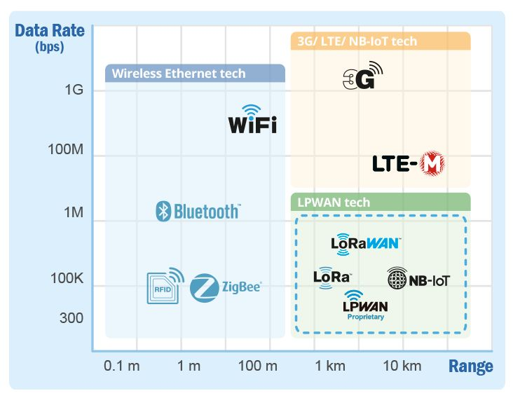
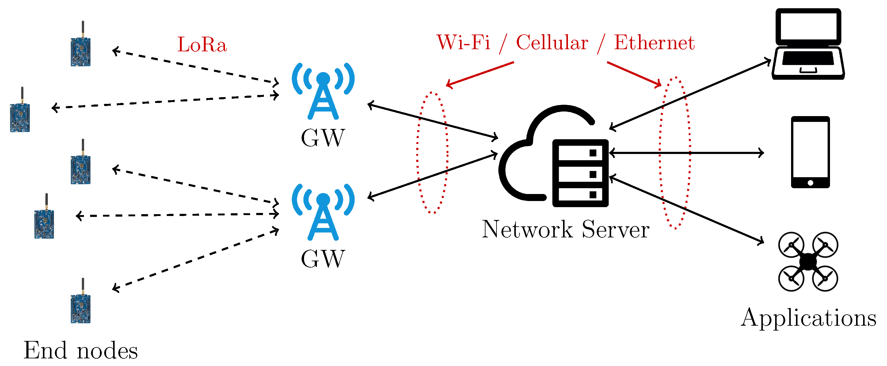
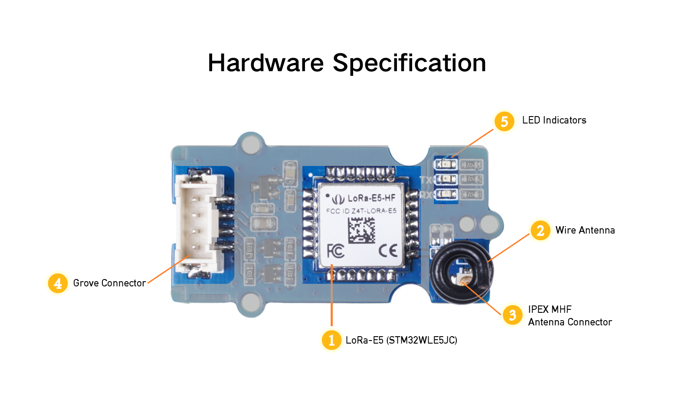
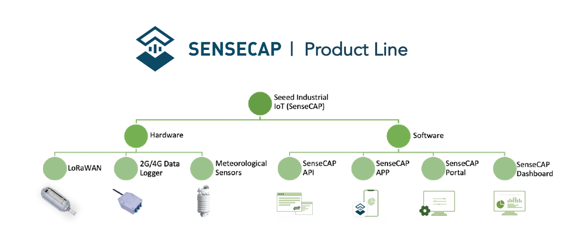
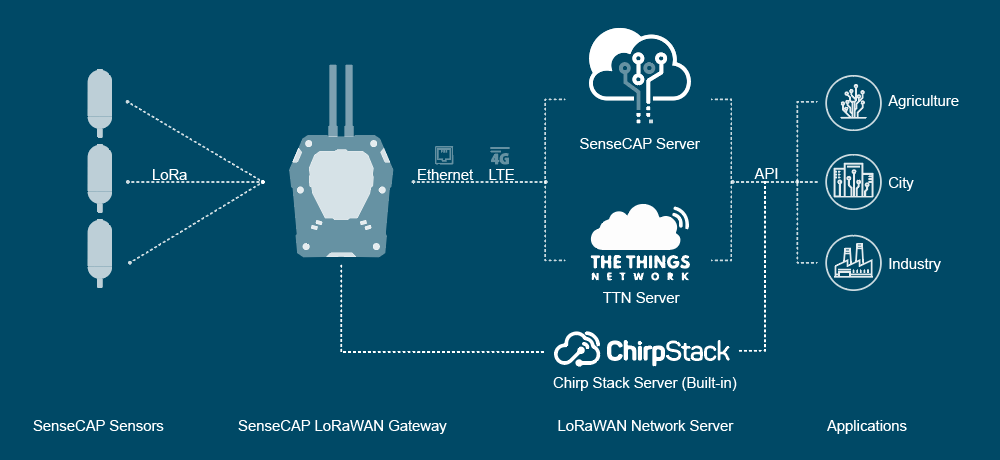
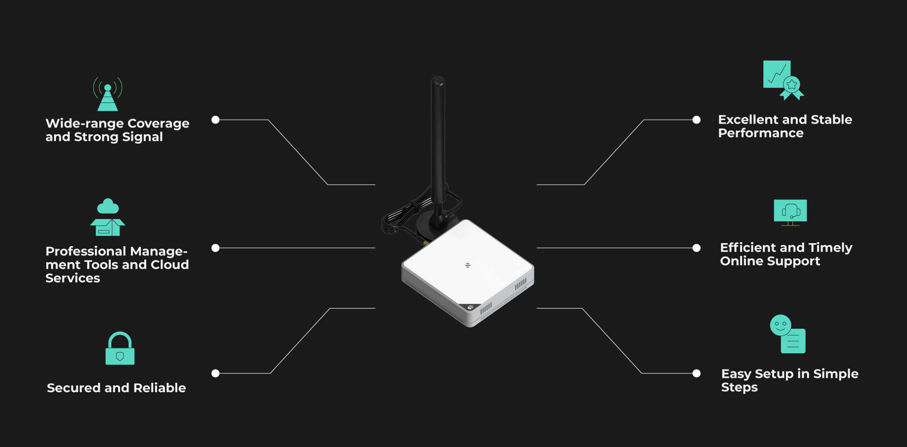
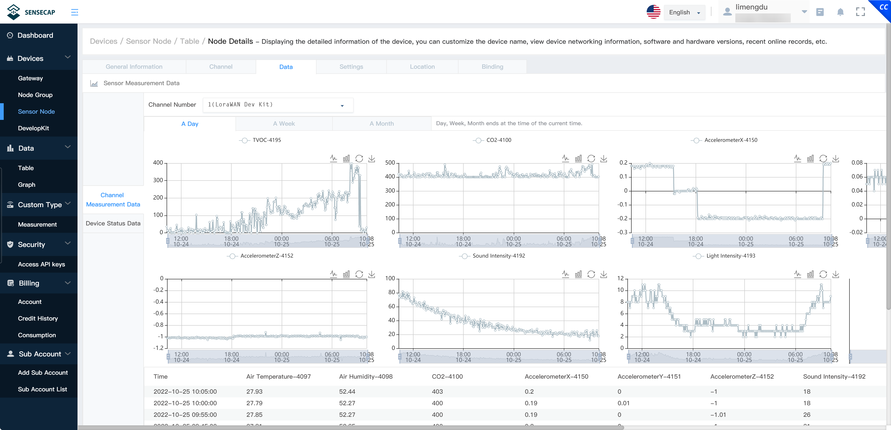

# SenseCAP K1100 and LoRaWAN®

## Introduction

The broad concept of the Internet of Things was first proposed by the Massachusetts Institute of Technology in 1999 and is defined as "a network concept that enables intelligent identification, positioning, tracking, monitoring and management by means of radio frequency identification (RFID), global positioning system and other information sensing devices, connected to any object through the Internet of Things domain name according to an agreed protocol, for information exchange and communication".

The essence of IoT (Internet of Things) is to connect various embedded microcontrollers, and this concept combines wireless connectivity with various smart sensors and with low-power microcontrollers to achieve a lower cost and simpler way of networking devices.

In recent years, the rapid development of technologies such as MEMS (Micro-Electro-Mechanical Systems) based sensors, MCU (Micro-Controllers), LPWAN (Low Power Wide Area Network), cloud computing and cloud storage have made the concept of IoT a hot topic again, and this area has become an important strategic layout for the global Internet giants in the future. It is the most imaginative market of the future.

In this lesson, we will take the more cutting-edge LoRa® network technology in IoT as an example and explain the application and power of Seeed Studio and SenseCAP series products in low-power IoT.

In this lesson we'll cover:

* [LPWA Technology](#lpwa-technology)
* [LoRa® Wireless Technology](#lora-wireless-technology)
* [About Grove Wio E5](#about-grove-wio-e5)
* [About SenseCAP Portal](#about-sensecap-portal)
* [SenseCAP architecture and product structure](#sensecap-architecture-and-product-structure)
* [LoRaWAN® Gateway](#lorawan-gateway)
* [Connect to SenseCAP](#comunicate-with-sensecap)
* [Upgrade to industrial grade SenseCAP devices](#upgrade-to-industrial-grade-sensecap-devices)

## LPWA Technology

Prior to the advent of LPWAN technology, IoT networks struggled to balance the paradox of wide coverage and low power/cost. Take GPRS (2G), the most common technology for IoT, as an example, it suffers from high power consumption, low connectivity per sector and limited network coverage area, which cannot meet the needs of IoT in different usage scenarios.
To improve the situation that GPRS cannot meet the demand of IoT connectivity, low-power wide-area netword (LPWAN) communication protocols such as LoRa® and SigFox, which operate in unlicensed frequency bands, have been proposed in the industry. At the same time, 3GPP, the industry standard setting body, has also proposed eMTC protocols based on LTE, EC-GSM protocols based on GSM and NB-IoT protocols.

Compared to 3G/4G cellular networks, LPWAN has advantages such as low cost, low energy consumption and wide coverage.

## LoRa® Wireless Technology

LoRa® is a wireless technology in the Low Power Wide Area Network (LPWAN). Compared to other wireless technologies (e.g. Sigfox, NB-IoT, etc.), the LoRa® industry chain is more mature and commercially available earlier. The Sub-GHz band makes it easier to communicate over long distances with low power consumption and can be powered by battery or other energy harvesting methods.

Advantages:
* 164 dB link budget, distances >15 km, fast.
* Flexible infrastructure, easy to network and low investment costs.
* LoRa® node modules for communication only, with a battery life of up to 10 years.
* Licence-free frequency bands, gateway/router construction and operation, low node/terminal costs.

## About Grove Wio E5

The Grove Wio E5 is a LoRa® product under the Seeed Studio Grove product line. Wio-E5 LoRaWAN® STM32WLE5JC module is the major functional part integrated into Grove - Wio-E5. It is a LoRaWAN® module that embedded with ARM Cortex M4 ultra-low-power MCU core and Long Range SX126x, as the world-first combo of Long Range RF and MCU chip into one single tiny module, it supports (G)FSK, BPSK, (G)MSK, and Long Range modulations, and is FCC, CE certified. Grove - Wio-E5 features extremely compacted size, ultra-low power consumption, low cost, and amazing performance. (Learn more about [Wio-E5](https://www.seeedstudio.com/LoRa-E5-Wireless-Module-p-4745.html))

Grove - Wio-E5 can endow your development boards' strong features of ultra-long transmitting range, great performance, and high efficiency by easiliy plug and play with Grove connector on board. By connecting Grove - Wio-E5 to your development boards, your devices is able to communicate with and control Wio-E5 conveniently by AT command through UART connection. 

## About SenseCAP Portal

The main function of the SenseCAP Portal is to manage SenseCAP devices and to store data. It is built on Azure, a secure and reliable cloud service from Microsoft. You can apply for an account and bind all devices to this account. SenseCAP provides the web portal and API. The web portal includes Dashboard, Device Management, Data Management, and Access Key Management, while API is open to users for further development.

> 🔗Global Station: https://sensecap.seeed.cc

## SenseCAP architecture and product structure

As a Seeed product series, SenseCAP consists of different hardware and software services, as you can see from the graph above. SenseCAP is specifically designed for serving Industrial IoT needs of wireless sensing, with the main applications in smart agriculture, smart city, and other environmental sensing scenarios.

Since 2018, we have been putting the accumulated resources, experience, and expertise into creating IIoT products for various environmental monitoring occasions. And we’ve spent years on putting the products into field tests in different countries and regions before making them generally available.

Currently, the SenseCAP IIoT collection consists of SenseCAP LoRaWAN® Series gateways & sensors, Sensor Hub 2G/4G Data Logger & RS-485 sensors, and Meteorological Sensors. Other than hardware, we also provide software & Cloud services including SenseCAP API, SenseCAP APP, SenseCAP Portal, and SenseCAP Dashboard for easily managing the devices and data. Please see more details below.

### Hardware Products

All Seeed IIoT hardware products are designed with industry standards, IP66 rated, and encapsulated in UV-resistant materials to ensure great robustness. They are suitable to be deployed in outdoor scenarios with severe conditions.

### LoRaWAN® Series

LoRaWAN® series comprise sensors and gateways which support LoRaWAN® protocol and are LoRaWAN® certified. These products are suitable for applications that need the wireless transmission of data across ultra-wide distance – 9.6 km in line of sight scene and 2 km in urban scenes, according to our testing. As well, the low power consumption features support a battery lifespan of an average of 3 years, some sensor nodes can last more than 8 years depending on the sensors’ power consumption.

SenseCAP LoRaWAN® sensors include those measuring CO2, Light, soil TH, air TH, air pressure, and so on. SenseCAP LoRaWAN® gateway is carrier-grade and has the capacity of working with up to 1000 sensors simultaneously. It’s suitable for the needs of gathering data in multiple locations such as soil moisture and temperature at different locations of the farm. In this case, you only need one gateway, and easily deploy several sensors across the farm. The deployment instruction is easy to follow, and it would only take you a few minutes to set up.

## LoRaWAN® Gateway

[SenseCAP M2 Data Only](https://www.seeedstudio.com/SenseCAP-M2-Data-Only-LoRaWAN-Indoor-Gateway-SX1302-US915-p-5342.html) is a LoRaWAN® Gateway connected to the Helium LongFi Network.

As a LoRaWAN® gateway, it could be able to provide miles of wireless network coverage and data transmission capacity for Long Range /LoRaWAN® devices. As a gateway supporting the Helium LongFi network, it could help you build the local LoRaWAN® network and develop various LoRaWAN® applications at low cost while enjoying the benefits of being a part of the People's Network. SenseCAP M2 is now providing US915 and EU868 versions with FCC and CE certificates. And it will have more frequency band versions and corresponding certificates available for different countries and regions in the near future.

If you want to connect to the SenseCAP Portal via the SenseCAP K1100, you will need to have a gateway or have LoRaWAN® network coverage available in advance. If you have your own LoRaWAN® gateway, please contact your supplier or configure LoRaWAN® yourself according to the gateway's manual, which will not be included in this course.

## Connect to SenseCAP

1. Press the rightmost top button to enter the **Network** tab. 

    

    You will notice that LoRa® is already highlighted.

2. **Middle press** to select **LoRa®** and connect **Grove-Wio E5** to the Grove connector on the left side.

    

3. Scroll through the LoRaWAN® frequency bands displayed on the screen and select the frequency band according to your region.

    

    Now it will prompt you to bind the Wio-E5 with the SenseCAP platform.

    

    We offer two ways to bind your device in the SenseCAP platform.

    - **Option 1. Bind the device on the mobile APP**

        If you want to use your cell phone to scan and bind your device, or view some of the sensor data remotely. Then please download SenseCAP Mate APP by yourself according to the following link.

        - [SenseCAP Mate APP for iOS](https://apps.apple.com/cn/app/sensecap-mate/id1619944834) on App Store
        - [SenseCAP Mate APP for Android](https://install.appcenter.ms/orgs/seeed/apps/sensecap-mate/distribution_groups/public) on the Google Play Store

        

        Open the SenseCAP Mate APP after downloading the corresponding version of the APP according to all the mobile systems you use. if it is your first time to use the SenseCAP platform, please register an account first.

        

        > 💁 Please select the **Global** version when registering.

        In the page of registration information filling, the fields with * are required fields, and those without * can be filled in optionally. Click the Register button after everything is completed.

        

        Then please use the account you just registered to log into the APP.

        Select Device directory at the bottom of the main interface, where you can see the information of all the SenseCAP devices you have bound.

        

        Click the **+** in the upper right corner and select **Add device** to bind the Grove - Wio-E5.

        

        Align the box in the center of the camera with the QR code **on the back of** the Grove - Wio-E5 to scan the code to bind your kit. **Please note that the QR code on the front of the Wio E5 should not be scanned**.

        

        After successful binding using the SenseCAP Mate App, you will see the sensor data displayed on the app.

        

	    > 💁 The SenseCAP Mate App will not automatically refresh the data information, you will need to manually scroll down on the sensor page to refresh the data.
	    If you do not see new data for more than 10 minutes, you can try restarting the Wio Terminal by toggling down the side button once.

    - **Option 2. Bind the device on the SenseCAP web platform**

        Please use your browser to open the [SenseCAP Console](https://sensecap.seeed.cc/portal/#/login). If this is your first time using our platform, please register an account first.

        

        Then log in to the SenseCAP console using the account you just registered.

        

        Select the **Dashboard** screen and click **Bind Device**.

        

        Then on the next page you will need to fill in the **EUI**, **Code/KEY** and **Device Name**, and you can even set the location for the device. (Grove - Wio-E5 does not have a location function)

        Some of the required information can be found on the sticker on the back of the Grove - Wio-E5. Please fill in the device name as you need it.

        

        After filling out the above content, click the **Confirm** button below to complete the device binding.

        After successful binding using the web platform you will see the sensor data displayed on the platform.

        

        > 💁 SenseCAP on the web also does not have automatic data refresh and you will need to refresh your browser to see the latest data.

    Once you have selected the band, you will need to wait a little while for the Grove Wio E5 to finish initialising.

    

    If the LoRaWAN® connection to SenseCAP platform is successful, you will see the following.

    

    If you are not connected to the Grove Wio E5 or if the LoRaWAN® is disconnected in the middle of the process, it will show a transmission failure.

    

    If all goes well, you'll see your data messages in the SenseCAP console every five minutes.

    

## Upgrade to industrial grade SenseCAP devices
With the SenseCAP [S2110 controller](https://www.seeedstudio.com/SenseCAP-XIAO-LoRaWAN-Controller-p-5474.html) and [S2100 data logger](https://www.seeedstudio.com/SenseCAP-S2100-LoRaWAN-Data-Logger-p-5361.html), you can easily turn the Grove into a LoRaWAN® sensor. Seeed not only helps you with prototyping but also offers you the possibility to expand your project with the SenseCAP series of robust [industrial sensors](https://www.seeedstudio.com/catalogsearch/result/?q=sensecap&categories=SenseCAP&application=Temperature%2FHumidity~Soil~Gas~Light~Weather~Water~Automation~Positioning~Machine%20Learning~Voice%20Recognition&compatibility=SenseCAP).

The IP66 housing, Bluetooth configuration, compatibility with the global LoRaWAN® network, built-in 19 Ah battery, and powerful support from APP make the [SenseCAP S210x](https://www.seeedstudio.com/catalogsearch/result/?q=S21&categories=SenseCAP~LoRaWAN%20Device&product_module=Device) the best choice for industrial applications. The series includes sensors for soil moisture, air temperature and humidity, light intensity, CO2, EC, and an 8-in-1 weather station. Try the latest SenseCAP S210x for your next successful industrial project.

<html>
    <table style="margin-left: auto; margin-right: auto;">
		<tr><td colspan="4" bgcolor="#3a545d" align="center"><strong>SenseCAP Industrial Sensor</strong></td>
		</tr>
        <tr>
            <td bgcolor="#3a545d"><a href="https://www.seeedstudio.com/SenseCAP-S2100-LoRaWAN-Data-Logger-p-5361.html" target="_blank">
</a>

            </td>
            <td bgcolor="#3a545d"><a href="https://www.seeedstudio.com/SenseCAP-S2101-LoRaWAN-Air-Temperature-and-Humidity-Sensor-p-5354.html" target="_blank">
</a>

            </td>
            <td bgcolor="#3a545d"><a href="https://www.seeedstudio.com/SenseCAP-S2102-LoRaWAN-Light-Intensity-Sensor-p-5355.html" target="_blank">
</a>

            </td>
            <td bgcolor="#3a545d"><a href="https://www.seeedstudio.com/SenseCAP-S2103-LoRaWAN-CO2-Temperature-and-Humidity-Sensor-p-5356.html" target="_blank">
</a>

            </td>
        </tr>
        <tr>
            <td bgcolor="#3a545d" align="center"><a href="https://www.seeedstudio.com/SenseCAP-S2100-LoRaWAN-Data-Logger-p-5361.html"  target="_blank"><strong>S2100   Data Logger</strong></a></td>
            <td bgcolor="#3a545d" align="center"><a href="https://www.seeedstudio.com/SenseCAP-S2101-LoRaWAN-Air-Temperature-and-Humidity-Sensor-p-5354.html"  target="_blank"><strong>S2101   Air Temp & Humidity</strong></a></td>
            <td bgcolor="#3a545d" align="center"><a href="https://www.seeedstudio.com/SenseCAP-S2102-LoRaWAN-Light-Intensity-Sensor-p-5355.html"  target="_blank"><strong>S2102   Light</strong></a></td>
            <td bgcolor="#3a545d" align="center"><a href="https://www.seeedstudio.com/SenseCAP-S2103-LoRaWAN-CO2-Temperature-and-Humidity-Sensor-p-5356.html"  target="_blank"><strong>S2103   Air Temp & Humidity & CO2</strong></a></td>
        </tr>
        <tr>
            <td bgcolor="#3a545d"><a href="https://www.seeedstudio.com/SenseCAP-S2104-LoRaWAN-Soil-Temperature-and-Moisture-Sensor-p-5357.html" target="_blank">
</a>

            </td>
            <td bgcolor="#3a545d"><a href="https://www.seeedstudio.com/SenseCAP-S2105-LoRaWAN-Soil-Temperature-Moisture-and-EC-Sensor-p-5358.html" target="_blank">
</a>

            </td>
            <td bgcolor="#3a545d"><a href="https://www.seeedstudio.com/SenseCAP-XIAO-LoRaWAN-Controller-p-5474.html" target="_blank">
</a>

            </td>
            <td bgcolor="#3a545d"><a href="https://www.seeedstudio.com/sensecap-s2120-lorawan-8-in-1-weather-sensor-p-5436.html" target="_blank">
</a>

            </td>
        </tr>
        <tr>
            <td bgcolor="#3a545d" align="center"><a href="https://www.seeedstudio.com/SenseCAP-S2104-LoRaWAN-Soil-Temperature-and-Moisture-Sensor-p-5357.html"  target="_blank"><strong>S2104   Soil Moisture & Temp</strong></a></td>
            <td bgcolor="#3a545d" align="center"><a href="https://www.seeedstudio.com/SenseCAP-S2105-LoRaWAN-Soil-Temperature-Moisture-and-EC-Sensor-p-5358.html"  target="_blank"><strong>S2105   Soil Moisture & Temp & EC</strong></a></td>
            <td bgcolor="#3a545d" align="center"><a href="https://www.seeedstudio.com/SenseCAP-XIAO-LoRaWAN-Controller-p-5474.html"  target="_blank"><strong>S2110   LoRaWAN® Controller</strong></a></td>
            <td bgcolor="#3a545d" align="center"><a href="https://www.seeedstudio.com/sensecap-s2120-lorawan-8-in-1-weather-sensor-p-5436.html"  target="_blank"><strong>S2120   8-in-1 Weather Station</strong></a></td>
        </tr>
    </table>
</html>

