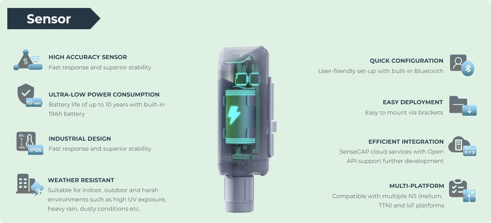

# SenseCAP K1100 and LoRaWAN

## Introduction

The broad concept of the Internet of Things was first proposed by the Massachusetts Institute of Technology in 1999 and is defined as "a network concept that enables intelligent identification, positioning, tracking, monitoring and management by means of radio frequency identification (RFID), global positioning system and other information sensing devices, connected to any object through the Internet of Things domain name according to an agreed protocol, for information exchange and communication".

The essence of IoT (Internet of Things) is to connect various embedded microcontrollers, and this concept combines wireless connectivity with various smart sensors and with low-power microcontrollers to achieve a lower cost and simpler way of networking devices.

In recent years, the rapid development of technologies such as MEMS (Micro-Electro-Mechanical Systems) based sensors, MCU (Micro-Controllers), LPWAN (Low Power Wide Area Network), cloud computing and cloud storage have made the concept of IoT a hot topic again, and this area has become an important strategic layout for the global Internet giants in the future. It is the most imaginative market of the future.

In this lesson, we will take the more cutting-edge LoRa network technology in IoT as an example and explain the application and power of Seeed Studio and SenseCAP series products in low-power IoT.

In this lesson we'll cover:

* [LPWA Technology](#lpwa-technology)
* [LoRa Wireless Technology](#lora-wireless-technology)
* [About Grove Wio E5](#about-grove-wio-e5)
* [About SenseCAP Portal](#about-sensecap-portal)
* [SenseCAP architecture and product structure](#sensecap-architecture-and-product-structure)
* [LoRaWAN Gateway](#lorawan-gateway)
* [Connect to SenseCAP](#comunicate-with-sensecap)
* [Upgrade to industrial grade SenseCAP devices](#upgrade-to-industrial-grade-sensecap-devices)

## LPWA Technology

Prior to the advent of LPWAN technology, IoT networks struggled to balance the paradox of wide coverage and low power/cost. Take GPRS (2G), the most common technology for IoT, as an example, it suffers from high power consumption, low connectivity per sector and limited network coverage area, which cannot meet the needs of IoT in different usage scenarios.
To improve the situation that GPRS cannot meet the demand of IoT connectivity, low-power wide-area netword (LPWAN) communication protocols such as LoRa and SigFox, which operate in unlicensed frequency bands, have been proposed in the industry. At the same time, 3GPP, the industry standard setting body, has also proposed eMTC protocols based on LTE, EC-GSM protocols based on GSM and NB-IoT protocols.

Compared to 3G/4G cellular networks, LPWAN has advantages such as low cost, low energy consumption and wide coverage.

## LoRa Wireless Technology

LoRa is a wireless technology in the Low Power Wide Area Network (LPWAN). Compared to other wireless technologies (e.g. Sigfox, NB-IoT, etc.), the LoRa industry chain is more mature and commercially available earlier. The Sub-GHz band makes it easier to communicate over long distances with low power consumption and can be powered by battery or other energy harvesting methods.

Advantages:
* 164 dB link budget, distances >15 km, fast.
* Flexible infrastructure, easy to network and low investment costs.
* LoRa node modules for communication only, with a battery life of up to 10 years.
* Licence-free frequency bands, gateway/router construction and operation, low node/terminal costs.

## About Grove Wio E5

The Grove Wio E5 is a LoRa product under the Seeed Studio Grove product line. Wio-E5 LoRaWAN STM32WLE5JC module is the major functional part integrated into Grove - Wio-E5. It is a LoRaWAN module that embedded with ARM Cortex M4 ultra-low-power MCU core and Long Range SX126x, as the world-first combo of Long Range RF and MCU chip into one single tiny module, it supports (G)FSK, BPSK, (G)MSK, and Long Range modulations, and is FCC, CE certified. Grove - Wio-E5 features extremely compacted size, ultra-low power consumption, low cost, and amazing performance. (Learn more about [Wio-E5](https://www.seeedstudio.com/LoRa-E5-Wireless-Module-p-4745.html))

Grove - Wio-E5 can endow your development boards' strong features of ultra-long transmitting range, great performance, and high efficiency by easiliy plug and play with Grove connector on board. By connecting Grove - Wio-E5 to your development boards, your devices is able to communicate with and control Wio-E5 conveniently by AT command through UART connection. 

## About SenseCAP Portal

The main function of the SenseCAP Portal is to manage SenseCAP devices and to store data. It is built on Azure, a secure and reliable cloud service from Microsoft. You can apply for an account and bind all devices to this account. SenseCAP provides the web portal and API. The web portal includes Dashboard, Device Management, Data Management, and Access Key Management, while API is open to users for further development.

> 🔗Global Station: https://sensecap.seeed.cc

## SenseCAP architecture and product structure

As a Seeed product series, SenseCAP consists of different hardware and software services, as you can see from the graph above. SenseCAP is specifically designed for serving Industrial IoT needs of wireless sensing, with the main applications in smart agriculture, smart city, and other environmental sensing scenarios.

Since 2018, we have been putting the accumulated resources, experience, and expertise into creating IIoT products for various environmental monitoring occasions. And we’ve spent years on putting the products into field tests in different countries and regions before making them generally available.

Currently, the SenseCAP IIoT collection consists of SenseCAP LoRaWAN Series gateways & sensors, Sensor Hub 2G/4G Data Logger & RS-485 sensors, and Meteorological Sensors. Other than hardware, we also provide software & Cloud services including SenseCAP API, SenseCAP APP, SenseCAP Portal, and SenseCAP Dashboard for easily managing the devices and data. Please see more details below.

### Hardware Products

All Seeed IIoT hardware products are designed with industry standards, IP66 rated, and encapsulated in UV-resistant materials to ensure great robustness. They are suitable to be deployed in outdoor scenarios with severe conditions.

### LoRaWAN Series LoRaWAN

LoRaWAN series comprise sensors and gateways which support LoRaWAN protocol and are LoRaWAN certified. These products are suitable for applications that need the wireless transmission of data across ultra-wide distance – 9.6 km in line of sight scene and 2 km in urban scenes, according to our testing. As well, the low power consumption features support a battery lifespan of an average of 3 years, some sensor nodes can last more than 8 years depending on the sensors’ power consumption.

SenseCAP LoRaWAN sensors include those measuring CO2, Light, soil TH, air TH, air pressure, and so on. SenseCAP LoRaWAN gateway is carrier-grade and has the capacity of working with up to 1000 sensors simultaneously. It’s suitable for the needs of gathering data in multiple locations such as soil moisture and temperature at different locations of the farm. In this case, you only need one gateway, and easily deploy several sensors across the farm. The deployment instruction is easy to follow, and it would only take you a few minutes to set up.

## LoRaWAN Gateway

[SenseCAP M2 Data Only](https://www.seeedstudio.com/SenseCAP-M2-Data-Only-LoRaWAN-Indoor-Gateway-SX1302-US915-p-5342.html) is a LoRaWAN Gateway connected to the Helium LongFi Network.

As a LoRaWAN gateway, it could be able to provide miles of wireless network coverage and data transmission capacity for Long Range /LoRaWAN devices. As a gateway supporting the Helium LongFi network, it could help you build the local LoRaWAN network and develop various LoRaWAN applications at low cost while enjoying the benefits of being a part of the People's Network. SenseCAP M2 is now providing US915 and EU868 versions with FCC and CE certificates. And it will have more frequency band versions and corresponding certificates available for different countries and regions in the near future.

If you want to connect to the SenseCAP Portal via the SenseCAP K1100, you will need to have a gateway or have LoRaWAN network coverage available in advance. If you have your own LoRaWAN gateway, please contact your supplier or configure LoRaWAN yourself according to the gateway's manual, which will not be included in this course.

## Connect to SenseCAP

## Upgrade to industrial grade SenseCAP devices

SenseCAP K1100 serves as a gateway to the higher-end SenseCAP LoRaWAN® series of industrial outdoor sensors. Users can prototype multiple AIoT applications with this kit, after which they can scale them up to the robust, long-life, and industrial [SenseCAP sensors](https://www.seeedstudio.com/iot_into_the_wild.html).

记得加lora商标！！！

