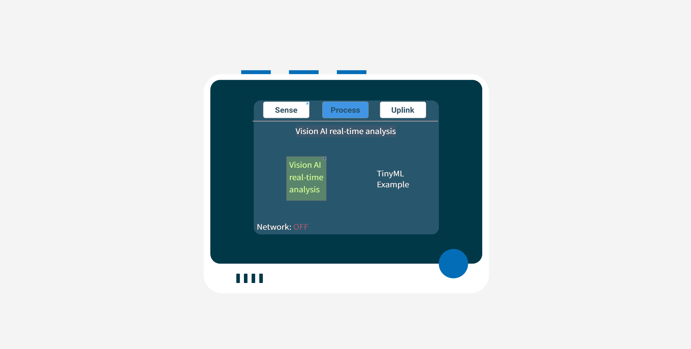

# SenseCAP K1100 - Real-time screen recognition

In this lesson, we will use the SenseCAP K1100 to implement real-time human detection via plug and play.

## Hardware

The Wio Terminal needs a [Grove Vision AI](https://www.seeedstudio.com/Grove-Vision-AI-Module-p-5457.html).

The module you will be using is a thumb-sized artificial intelligence camera with pre-installed machine learning algorithms for human detection - Grove Vision AI. Artificial intelligence cameras (AI Cameras) are enhanced cameras powered by built-in edge-to-edge machine learning algorithms that use computational photography technology for intelligent processing to perform real-time enhanced target detection. Such cameras are now widely used in smartphones for face recognition, edge devices for wildlife detection, and other edge intelligence applications.

Seeed Studio has reserved the common I²C communication interface for this AI camera so that the user can obtain the objects and the number of objects recognised by the camera directly by using I²C communication.

## Connect the camera

The Grove Vision AI camera can be connected to the I²C interface of the Wio Terminal.

### Task - connect the camera

Connect the AI camera.

1. Insert one end of a Grove cable into the socket on the Grove Vision AI camera. It will only go in one way round.

2. With the Wio Terminal disconnected from your computer or other power supply, connect the other end of the Grove cable to the left-hand side Grove socket on the Wio Terminal as you look at the screen. This is the socket closest away from the power button.

3. You can now connect the Wio Terminal to your computer.

## Use Grove Vision AI sensor

The SenseCAP K1100 can now observe the Grove Vision AI sensor result via the SenseCraft program.

### Task - Observe the Grove Vision AI sensor data

1. Please complete the SenseCraft update and power up the Wio Terminal as per the previous lessons.

2. Please use the original USB-C cable to connect the Wio Terminal to your computer.

3. When you are facing the front screen of the Wio Terminal, press the blue button on the far left at the top (which is the one closest from the power button) to go to the Sense page.

4. You need to press the right arrow button under the Sense page until the value of the soil moisture sensor data appears. Usually, the value of the external sensor will be after the IMU sensor.

    When you point Grove Vision AI's camera squarely at one or more people, Vision AI displays the number of people recognised and the average confidence level on the screen.

    

5. The main function of the **Process** page is to show the process of data processing. We have currently developed log output for this page for the recognition and model processing of the Grove Vision AI module.

    

6. Click on the second button above the Wio Terminal to access the Process screen. The default selection under the Process screen is "Vision AI real-time analysis", at which point we simply middle press on the 5-way button to enter. 

    

    Then you will be able to see Vision AI log on this page.

    

😀 Your Grove Vision AI program was a success!

